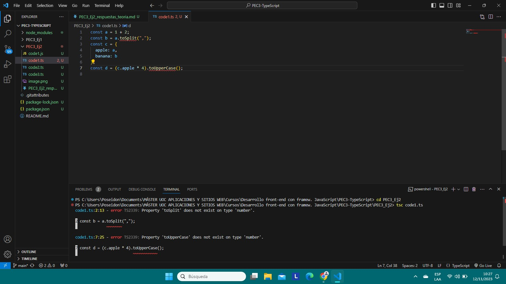

1. Respuesta a ejercicio code1.ts:
El error se produce porque las propiedades o métodos que se intentan invocar a partir de las variables dadas, no corresponden ni mucho menos pertenecen a los tipos de datos de las mismas. La situación refleja una ventaja importante dentro del uso de TypeScript, ya que su sistema de tipos estáticos brinda seguridad y previene errores durante el tiempo de compilación y no después (tal y como sucede a menudo en JavaScript), lo cual a su vez ahorra costos y facilita la legibilidad y estructuración robusta del código.

2. Respuesta a ejercicio code2.ts:
const a = 1042;                     // Tipo number
const b = 'apples and oranges';     // Tipo string
const c = 'pineapples';             // Tipo string
const d = [true, true, false];      // Tipo object
const e = { type: 'ficus' };        // Tipo object
const f = [1, false];               // Tipo object
const g = [3];                      // Tipo object
const h = null;                     // Tipo object

En TypeScript, se presenta lo que se conoce como "asignación implicita", que se traduce en la capacidad de TypeScript para inferir el tipo de dato que se asigna en una viariable, sin necesidad que el mismo se especifique al momento de la declaración, por lo tanto, la capacidad en mención mas el uso de la función "typeof" permiten inferir y especificar los tipos de datos de una variable.

3. Respuesta a ejercicio code3.ts:
a. "Cannot assign to 'i' because it is a constant": este error se da debido a que las variables decalaradas con la palabra clave "const", definen uan referencia constante a un valor, razón por la cual no se les puede reasignar valor alguno tras su declaración.
b. "Argument of type 'string' is not assignable to parameter of type 'number'": este error se da debido a que el sistema de tipos estáticos de TypeScript es robusto y no permite la reasignación de valores que no correspondan al tipo inferido de una variable tras su declaración.
c. "Type 'number' is not assignable to type 'never'": este error se da debido a que las variables de tipo "never" en su naturaleza, arroja efectivamente un error cada vez que se define.
d. The left-hand side of an arithmetic operation must be of type 'any', 'number', 'bigint' or an enum type.
let m = l * 2; // Error TS2571: Object is of type 'unknown': Los errores se dan debido a que se está intentando acceder a una propiedad sobre algo marcado como desconocido antes de limitarlo.

4. ¿Cuál es la diferencia entre una clase y una interface en TypeScript?
La interfaz, tiene todas las posibilidades de verificación de tipos en cualquier objeto que implemente la misma, pero a diferencia de las clases, no tiene forma de inicializar las propiedades de una clase y no puede tener ninguna implementación para las funciones en una clase.
